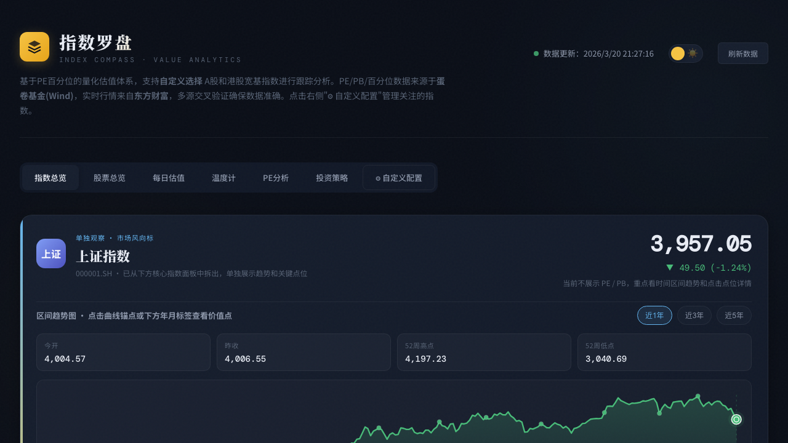
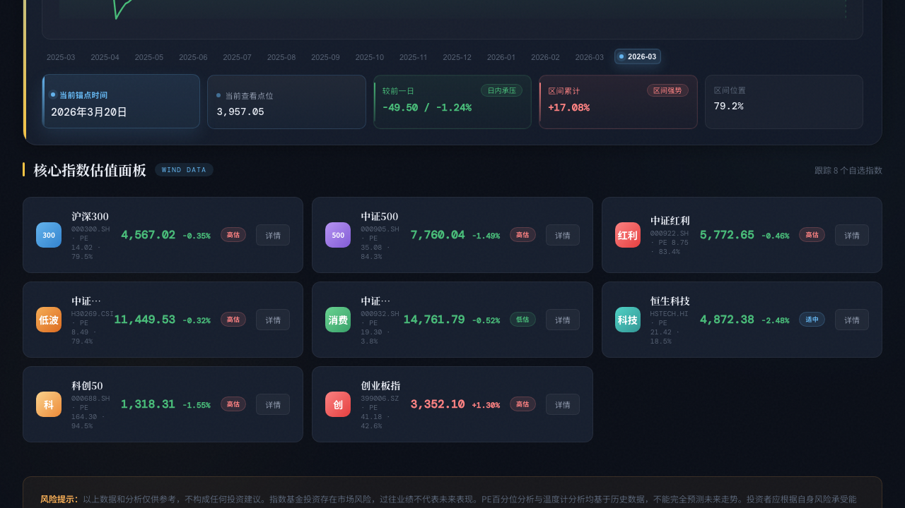
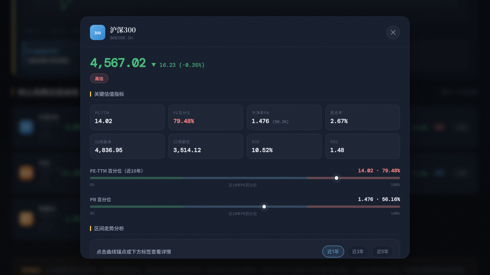
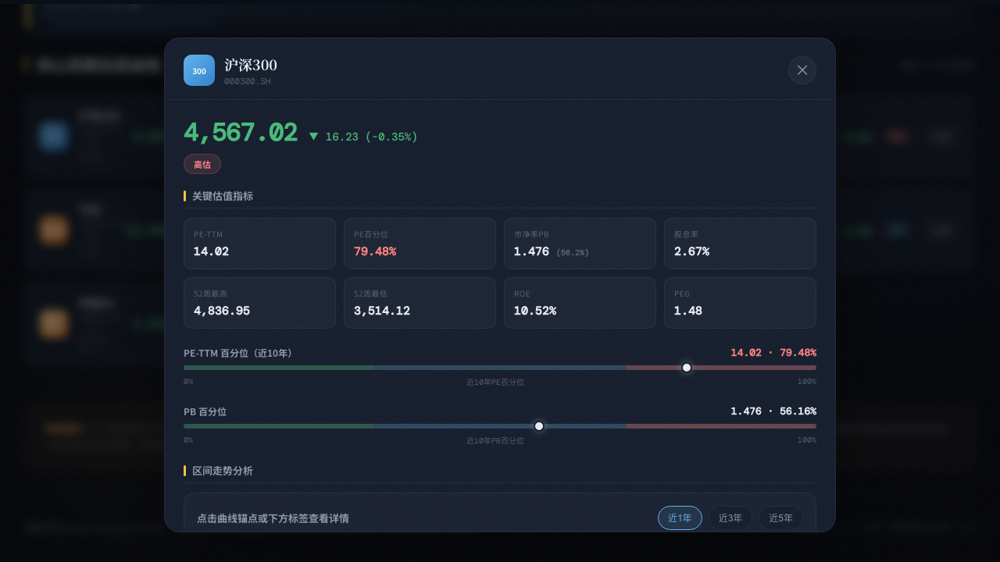
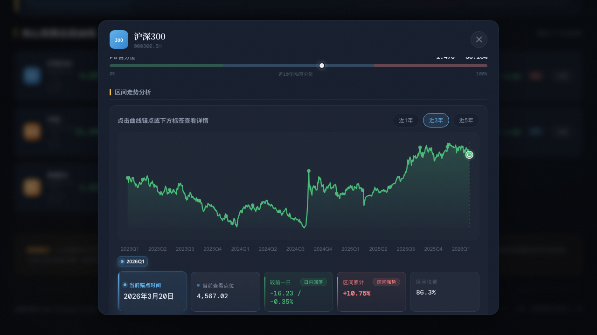
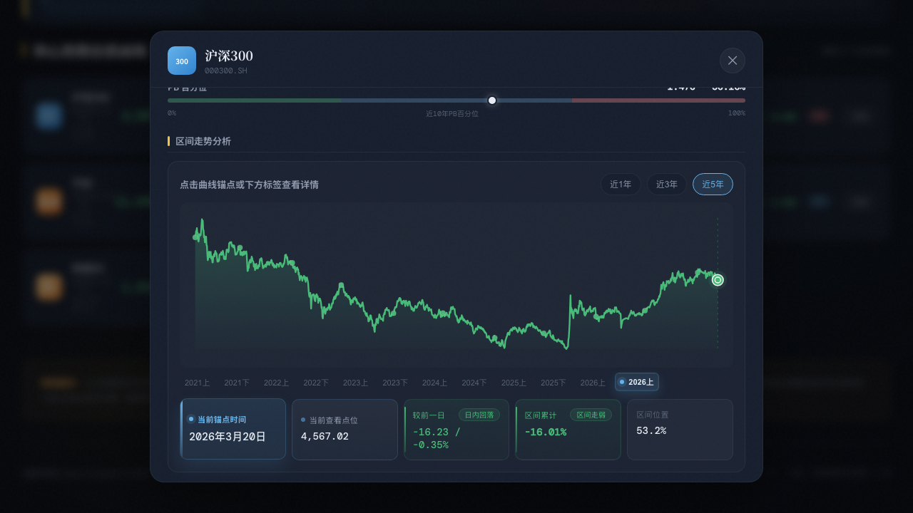

# 🧭 大乐罗盘 · Dale Compass

> A股价值分析系统 — 面向个人投资者的一站式指数/股票/ETF/基金分析工具



---

## ✨ 功能特性

### 📊 多品种覆盖
- **指数估值** — 沪深300、中证500、创业板指等主流宽基指数的 PE/PB/百分位/ROE/股息率
- **股票行情** — 个股实时行情追踪，自动识别行业板块
- **ETF 总览** — ETF 实时行情、分时图、1年/3年/5年 K线走势
- **严选基金** — 指数基金与主动基金净值、收益率分析

### 📈 投资决策支持
- **每日估值** — 基于 Wind 数据的全量指数每日估值表，按低估/适中/高估三档分类
- **温度计** — 知有行温度计数据，展示全市场温度与各指数温度详情
- **PE 分析** — PE 百分位全景可视化（10年百分位水位图）+ 估值详细分析
- **投资策略** — 操作策略表、温度计定投策略、加仓基准与加仓记录管理

### 🎨 UI 设计
- 暗色/亮色主题一键切换
- 渐变卡片、毛玻璃效果、动画呼吸灯等精致视觉元素
- 交易时段感知（交易中/已收盘/盘前状态指示）
- 交易时段内自动轮询刷新行情数据
- 响应式设计，适配桌面和移动端

### 🔐 用户系统
- PBKDF2-SHA512 密码哈希（10000 轮迭代 + 随机 salt）
- HttpOnly Cookie + 内存 Session 认证
- 管理员/普通用户角色权限控制

---

## 📸 截图

| 总览面板 | 摘要网格 |
|:---:|:---:|
|  |  |

| 详情弹窗 | 趋势图 |
|:---:|:---:|
|  |  |

| 3年视图 | 5年视图 |
|:---:|:---:|
|  |  |

---

## 🛠 技术栈

| 层面 | 技术 |
|---|---|
| **运行时** | Node.js 18/20 LTS |
| **Web 框架** | Express 4.18 |
| **HTTP 请求** | node-fetch 2.7 |
| **编码转换** | iconv-lite 0.6（处理 GBK 编码的金融数据源） |
| **进程管理** | PM2 6.0 |
| **前端** | 纯原生 HTML/CSS/JS 单文件 SPA（零构建依赖，无 React/Vue/Webpack） |
| **字体** | Google Fonts — Noto Serif SC, Noto Sans SC, DM Mono |
| **数据持久化** | JSON 文件（无数据库） |

---

## 📁 项目结构

```
dale-compass/
├── server.js                    # 主入口（Express 服务 + API 路由 + 认证系统）
├── package.json                 # 项目配置
├── ecosystem.config.js          # PM2 进程管理配置
├── services/                    # 后端数据采集服务层
│   ├── dataFetcher.js          #   指数数据采集（蛋卷/东方财富/知有行等多源）
│   ├── stockFetcher.js         #   股票实时行情采集
│   ├── fundFetcher.js          #   基金数据采集
│   └── etfFetcher.js           #   ETF 数据采集
├── public/                      # 前端静态资源
│   ├── index.html              #   单文件 SPA（全部 HTML+CSS+JS）
│   └── favicon.*               #   各尺寸图标
├── data/                        # 运行态数据（JSON 持久化）
│   ├── index-watchlist.json    #   指数关注列表
│   ├── stock-watchlist.json    #   股票关注列表
│   ├── etf-watchlist.json      #   ETF 关注列表
│   ├── fund-watchlist.json     #   基金关注列表
│   ├── datasource-config.json  #   数据源配置
│   ├── dca-plan.json           #   温度计定投策略
│   ├── position-benchmark.json #   加仓基准
│   ├── position-records.json   #   加仓记录
│   └── users.json              #   用户账户数据
├── scripts/
│   └── package-deploy.sh       #   打包发布脚本
├── dist/                        # 部署相关
│   ├── deploy.sh               #   一键部署脚本
│   ├── DEPLOYMENT_MANUAL.md    #   详细部署手册
│   └── OPS_QUICK_GUIDE.md     #   运维快速指南
├── screenshots/                 # 项目截图
└── logs/                        # PM2 日志
```

---

## 🚀 快速开始

### 环境要求

- Node.js 18+ (推荐 20 LTS)
- npm

### 安装与运行

```bash
# 克隆项目
git clone <repo-url>
cd dale-compass

# 安装依赖
npm install

# 启动服务
npm start
# 服务将在 http://localhost:3200 启动
```

### 默认账户

首次启动会自动创建管理员账户：

- 用户名：`admin`
- 密码：`admin123`

> ⚠️ 请在首次登录后修改默认密码

---

## 🌐 数据源

系统聚合多个公开金融数据源，具备**多源 failover 和 stale 缓存回退**能力：

| 数据源 | 提供内容 | 状态 |
|---|---|---|
| **蛋卷基金 (Wind)** | PE/PB/百分位/股息率/ROE | 🔒 内置，强制启用 |
| **东方财富** | 实时行情、历史K线、基金数据、搜索 | 🔒 内置，强制启用 |
| **知有行** | 指数温度计 | 🔒 内置，强制启用 |
| 天天基金 | 估值/净值（备用源） | ⚙️ 可选 |
| ETF.run | ETF 估值 | ⚙️ 可选 |
| 亿牛网 | 估值数据 | ⚙️ 可选 |
| 中证指数 | 官方估值 | ⚙️ 可选 |
| 腾讯/新浪行情 | 行情备用源 | ⚙️ 可选 |

可在系统「⚙ 数据源管理」页面中可视化切换各可选数据源的启用/禁用状态。

---

## 📡 API 接口

### 认证

| 方法 | 路径 | 说明 |
|---|---|---|
| POST | `/api/auth/register` | 用户注册 |
| POST | `/api/auth/login` | 用户登录 |
| POST | `/api/auth/logout` | 退出登录 |
| GET | `/api/auth/me` | 获取当前用户信息 |

### 指数

| 方法 | 路径 | 说明 |
|---|---|---|
| GET | `/api/indices` | 获取全部指数数据（含估值） |
| GET | `/api/indices/quotes` | 获取指数实时行情 |
| GET | `/api/indices/watchlist` | 获取关注列表 |
| GET | `/api/indices/search?q=` | 搜索指数 |
| POST | `/api/indices/add` | 添加指数 |
| POST | `/api/indices/remove` | 移除指数 |

### 基金

| 方法 | 路径 | 说明 |
|---|---|---|
| GET | `/api/active-funds` | 获取基金数据 |
| GET | `/api/active-funds/watchlist` | 获取关注列表 |
| GET | `/api/active-funds/search?q=` | 搜索基金 |
| POST | `/api/active-funds/add` | 添加基金 |
| POST | `/api/active-funds/remove` | 移除基金 |

### 股票

| 方法 | 路径 | 说明 |
|---|---|---|
| GET | `/api/stocks` | 获取股票行情 |
| GET | `/api/stocks/watchlist` | 获取关注列表 |
| GET | `/api/stocks/search?q=` | 搜索股票 |
| POST | `/api/stocks/add` | 添加股票 |
| POST | `/api/stocks/remove` | 移除股票 |

### ETF

| 方法 | 路径 | 说明 |
|---|---|---|
| GET | `/api/etfs` | 获取 ETF 行情 |
| GET | `/api/etfs/watchlist` | 获取关注列表 |
| GET | `/api/etfs/search?q=` | 搜索 ETF |
| POST | `/api/etfs/add` | 添加 ETF |
| POST | `/api/etfs/remove` | 移除 ETF |
| GET | `/api/etfs/minute?secid=` | ETF 分时数据 |
| GET | `/api/etfs/klines?secid=&range=` | ETF K线数据（1y/3y/5y） |

### 估值与温度计

| 方法 | 路径 | 说明 |
|---|---|---|
| GET | `/api/daily-eval` | 每日估值全量数据（Wind） |
| GET | `/api/thermometer/detail?code=` | 单指数温度详情 |

### 投资策略

| 方法 | 路径 | 说明 |
|---|---|---|
| GET | `/api/strategy/dca-plans` | 获取定投策略 |
| POST | `/api/strategy/dca-plans` | 新增/更新策略 |
| POST | `/api/strategy/dca-plans/delete` | 删除策略 |
| GET | `/api/position/benchmarks` | 获取加仓基准 |
| POST | `/api/position/benchmarks` | 新增/更新基准 |
| POST | `/api/position/benchmarks/delete` | 删除基准 |
| GET | `/api/position/records` | 获取加仓记录 |
| POST | `/api/position/records` | 新增记录 |
| POST | `/api/position/records/delete` | 删除记录 |

### 运维

| 方法 | 路径 | 说明 |
|---|---|---|
| GET | `/api/health` | 健康检查 |
| GET | `/api/datasources` | 获取数据源配置 |
| POST | `/api/datasources` | 保存数据源配置 |

---

## 🖥 生产部署

### PM2 管理

```bash
npm run pm2:start      # 启动
npm run pm2:restart    # 重启
npm run pm2:stop       # 停止
npm run pm2:logs       # 查看最近 100 行日志
npm run pm2:status     # 查看进程状态
```

### 打包发布

```bash
npm run package:deploy
# 生成 dist/dale-compass-YYYYMMDD-HHMMSS.tar.gz + SHA256 校验文件
```

### 服务器一键部署

```bash
bash deploy.sh <安装包路径>
# 自动完成：环境检查 → 备份 → 解压 → npm ci → PM2 启动 → 健康检查 → 开机自启
```

> 详细部署文档见 [dist/DEPLOYMENT_MANUAL.md](dist/DEPLOYMENT_MANUAL.md)，运维速查见 [dist/OPS_QUICK_GUIDE.md](dist/OPS_QUICK_GUIDE.md)

### 运行配置

| 配置项 | 默认值 | 说明 |
|---|---|---|
| 端口 | `3200` | 可通过环境变量 `PORT` 修改 |
| 内存限制 | `512MB` | PM2 超限自动重启 |
| 缓存 TTL | `5 分钟` | 自动失效，支持手动强制刷新 |
| 日志位置 | `logs/` | `out.log` + `error.log` |

---

## ⚠️ 注意事项

1. **网络要求** — 服务器需要能访问外网金融数据源（eastmoney、danjuanfunds、youzhiyouxing 等）
2. **端口放行** — 确保防火墙和安全组已放行 3200 端口
3. **数据备份** — `data/` 目录下的 JSON 文件是运行态数据，升级时务必备份
4. **各类上限** — 关注列表最多 20 项，用户数上限 100，加仓记录上限 500 条

---

## 📄 License

私有项目，仅供个人使用。
